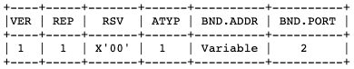

# socks原理

在socks生命周期中一共有3个阶段：握手阶段、请求阶段和Relay阶段。

### 握手阶段

握手阶段分为协商和子协商阶段

#### 协商阶段

.png>)

VER: 协议版本，socks5为`0x05`

NMETHODS: 支持认证的方法数量

METHODS: 对应NMETHODS，NMETHODS的值为多少，METHODS就有多少个字节。RFC预定义了一些值的含义，内容如下:

* X’00’ NO AUTHENTICATION REQUIRED
* X’01’ GSSAPI
* X’02’ USERNAME/PASSWORD
* X’03’ to X’7F’ IANA ASSIGNED
* X’80’ to X’FE’ RESERVED FOR PRIVATE METHODS
* X’FF’ NO ACCEPTABLE METHODS

socks5服务器需要选中一个METHOD返回给客户端，格式如下:

.png>)

当客户端收到`0x00`时，会跳过认证阶段直接进入请求阶段; 当收到`0xFF`时，直接断开连接。其他的值进入到对应的认证阶段。

#### 子协商阶段（认证阶段）

认证阶段作为协商的一个子流程，它**不是必须**的。socks5服务器可以决定是否需要认证，如果不需要认证，那么认证阶段会被直接略过。

如果需要认证，客户端向socks5服务器发起一个认证请求，这里以`0x02`的认证方式举例:

.png>)

* VER: 版本，通常为`0x01`
* ULEN: 用户名长度
* UNAME: 对应用户名的字节数据
* PLEN: 密码长度
* PASSWD: 密码对应的数据

socks5服务器收到客户端的认证请求后，解析内容，验证信息是否合法，然后给客户端响应结果。响应格式如下:

.png>)

STATUS字段如果为`0x00`表示认证成功，其他的值为认证失败。当客户端收到认证失败的响应后，它将会断开连接。

### 请求阶段

顺利通过协商阶段后，客户端向socks5服务器发起请求细节，格式如下:

.png>)

* VER 版本号，socks5的值为`0x05`
* CMD
  * `0x01`表示CONNECT请求
  * `0x02`表示BIND请求
  * `0x03`表示UDP转发
* RSV 保留字段，值为`0x00`
* ATYP 目标地址类型，DST.ADDR的数据对应这个字段的类型。
  * `0x01`表示IPv4地址，DST.ADDR为4个字节
  * `0x03`表示域名，DST.ADDR是一个可变长度的域名
  * `0x04`表示IPv6地址，DST.ADDR为16个字节长度
* DST.ADDR 一个可变长度的值
* DST.PORT 目标端口，固定2个字节

上面的值中，DST.ADDR是一个变长的数据，它的数据长度根据ATYP的类型决定。我们可以通过掐头去尾解析出这部分数据。

socks5服务器收到客户端的请求后，需要返回一个响应，结构如下

* VER socks版本，这里为`0x05`
* REP Relay field,内容取值如下
  * X’00’ succeeded
  * X’01’ general SOCKS server failure
  * X’02’ connection not allowed by ruleset
  * X’03’ Network unreachable
  * X’04’ Host unreachable
  * X’05’ Connection refused
  * X’06’ TTL expired
  * X’07’ Command not supported
  * X’08’ Address type not supported
  * X’09’ to X’FF’ unassigned
* RSV 保留字段
* ATYPE 同请求的ATYPE
* BND.ADDR 服务绑定的地址
* BND.PORT 服务绑定的端口DST.PORT

当我们的relay server和socks5 server是同一台服务器时，`BND.ADDR`和`BND.PORT`的值全部为0即可。当我们的socks5 server和relay server不是一体的，就需要告知客户端relay server的地址，这个地址就是BND.ADDR和BND.PORT。

### Relay阶段

socks5服务器收到请求后，解析内容。如果是UDP请求，服务器直接转发; 如果是TCP请求，服务器向目标服务器建立TCP连接，后续负责把客户端的所有数据转发到目标服务。
